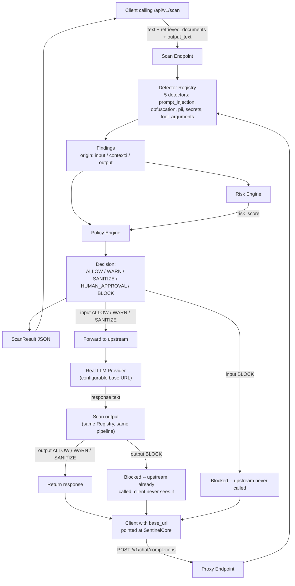

# Architecture

What's actually built and running today (v0.3.0) — not the long-term vision. For what's planned but not implemented, see the Current Status table in the main README and `docs/CAPABILITY_MATRIX.md`.

## Request flow

## Components

| Component | File(s) | What it does |
|---|---|---|
| **Finding schema** | `app/models/finding.py` | The common data shape every detector, the risk engine, and the policy engine speak. A `Finding` is one detector's output; a `ScanResult` bundles all findings for one request plus the final score/decision. |
| **Detector interface** | `app/detectors/base.py`, `registry.py` | Every detector subclasses `BaseDetector` and self-registers with `@register_detector`. The gateway discovers detectors through the registry — it never imports a specific detector class by name. |
| **Prompt injection detector** | `app/detectors/prompt_injection/` | Regex/heuristic phrase matching. Looks at what the text *means*. |
| **Obfuscation detector** | `app/detectors/obfuscation/` | Character/encoding-level checks. Looks at how the text is *encoded*, independent of meaning. |
| **PII detector** | `app/detectors/pii/` | Emails, phone numbers, SSNs, credit card-shaped numbers, IPs. Matched text is always redacted before it reaches a `Finding`. |
| **Secret detector** | `app/detectors/secrets/` | AWS keys, private key blocks, generic API key assignments, JWTs, bearer tokens, DB connection strings. Same redaction guarantee as PII. |
| **Tool argument detector** | `app/detectors/tool_arguments/` | SQL/shell-injection-shaped patterns and path traversal, applied to serialized tool arguments. A normal registered detector — also runs on ordinary input. |
| **Risk engine** | `app/services/risk_engine.py` | Combines findings into one 0-100 score. Deterministic, no ML. |
| **Policy engine** | `app/services/policy_engine.py`, `policy.yaml` | Maps findings + score to a final decision. Two layers, most-severe-wins. Fully configurable without code changes. |
| **Tool policy** | `app/services/tool_policy.py`, `tool_policy.yaml` | Deterministic allow/warn/sanitize/human_approval/block lookup by tool *name* — separate from the risk-scored content pipeline. |
| **Scan endpoint** | `app/api/v1/scan.py` | Wires the above into one request: detect → score → decide. Scans `text` (origin `input`), optional `retrieved_documents` (origin `context:<i>`), and optional `output_text` (origin `output`). |
| **Reverse proxy** | `app/api/v1/proxy.py`, `app/services/proxy.py` | `POST /v1/chat/completions` — an OpenAI-path-compatible drop-in gateway. Scans the request *and* the upstream's actual response, including streaming, through the same pipeline. |
| **Tool-call endpoint** | `app/api/v1/tool_call.py` | `POST /api/v1/scan/tool-call` — combines tool-name authorization with content scanning of arguments and tool response. |
| **MCP tool scanning** | `app/api/v1/mcp.py` | `POST /api/v1/scan/mcp-tools` — accepts real MCP `tools/list` shape directly. Recursively scans every `description` field for tool poisoning. |
| **Audit log** | `app/services/audit_log.py`, `app/api/v1/audit.py` | Persists every decision (SQLite) as metadata only. Queryable via `GET /api/v1/audit/recent`. |
| **Dashboard** | `app/static/dashboard.html`, `app/api/v1/dashboard.py` | `GET /dashboard` — a single static page, polling `GET /api/v1/audit/recent` every 5s. |
| **Authentication** | `app/core/auth.py` | Real API-key + role-based authorization, applied to every scan/tool-call/mcp/proxy/audit endpoint. Off by default. |

## Why detectors are separate from risk/policy

Detectors only ever answer "what did I find" — they never decide what should happen about it. That split is deliberate: the risk model and policy rules can change without touching a single detector, and a new detector can ship without knowing anything about scoring or policy.

## Evaluation & regression tooling

| Component | File(s) | What it does |
|---|---|---|
| **Dataset normalization** | `scripts/build_eval_dataset.py` | Converts raw external datasets (`dataset/raw/`) into one unified schema. |
| **Evaluation** | `scripts/evaluate.py` | Runs the full pipeline against the labeled dataset, computes precision/recall/F1/FPR. |
| **Attack Replay Lab** | `scripts/replay_lab.py` | Snapshots per-example predictions under a version tag; compares any two snapshots. |

## What's not in this diagram yet

Rate limiting, real sanitization execution, and enterprise/multi-tenant scale are designed but not implemented — see `docs/CAPABILITY_MATRIX.md` and `docs/hardening/STATUS.md` for exactly what's done vs planned.
