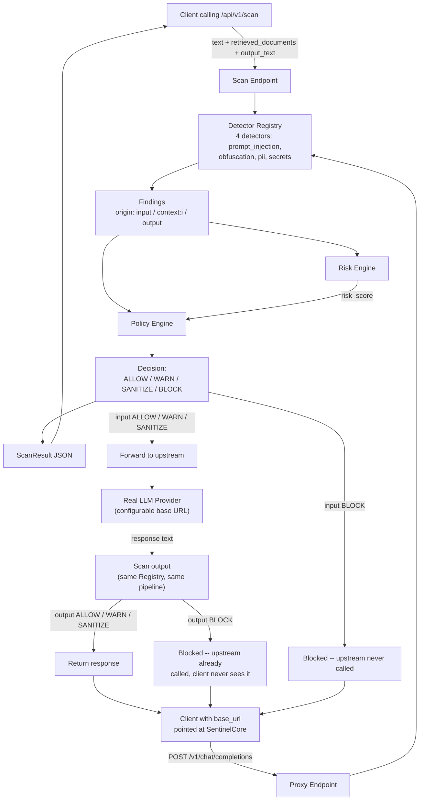

# Architecture

What's actually built and running today (v0.2) — not the long-term vision. For what's planned but not implemented, see the Current Status table in the main README.

## Request flow

## Components

| Component | File(s) | What it does |
|---|---|---|
| **Finding schema** | `app/models/finding.py` | The common data shape every detector, the risk engine, and the policy engine speak. A `Finding` is one detector's output; a `ScanResult` bundles all findings for one request plus the final score/decision. |
| **Detector interface** | `app/detectors/base.py`, `registry.py` | Every detector subclasses `BaseDetector` and self-registers with `@register_detector`. The gateway discovers detectors through the registry — it never imports a specific detector class by name. This is what makes adding a detector a no-core-changes operation (see `CONTRIBUTING.md`). |
| **Prompt injection detector** | `app/detectors/prompt_injection/` | Regex/heuristic phrase matching. Looks at what the text *means*. |
| **Obfuscation detector** | `app/detectors/obfuscation/` | Character/encoding-level checks. Looks at how the text is *encoded*, independent of meaning — a deliberately different mechanism than prompt_injection. See `docs/threat-model/README.md` for why both are needed together. |
| **PII detector** | `app/detectors/pii/` | Emails, phone numbers, SSNs, credit card-shaped numbers, IPs. Matched text is always redacted before it reaches a `Finding` — never stored or returned raw. |
| **Secret detector** | `app/detectors/secrets/` | AWS keys, private key blocks, generic API key assignments, JWTs, bearer tokens, DB connection strings. Same redaction guarantee as PII. |
| **Risk engine** | `app/services/risk_engine.py` | Combines findings into one 0-100 score. Deterministic, no ML. |
| **Policy engine** | `app/services/policy_engine.py`, `policy.yaml` | Maps findings + score to a final decision. Two layers (per-type rules, then score thresholds), most-severe-wins. Fully configurable without code changes. |
| **Scan endpoint** | `app/api/v1/scan.py` | Wires the above into one request: detect → score → decide. Scans `text` (origin `input`), optional `retrieved_documents` (origin `context:<i>`), and optional `output_text` (origin `output`) through the identical pipeline. |
| **Reverse proxy** | `app/api/v1/proxy.py`, `app/services/proxy.py` | `POST /v1/chat/completions` — an OpenAI-path-compatible drop-in gateway. Scans the request *and* the upstream's actual response through the same pipeline; a BLOCK on either side means the caller never sees the content. Streaming responses are scanned incrementally, chunk by chunk, with the ability to cut a response off mid-stream via a protocol-correct `content_filter` signal. Credentials pass through untouched. |
| **Audit log** | `app/services/audit_log.py`, `app/api/v1/audit.py` | Persists every decision (SQLite) as metadata only — `scan_id`, timestamp, endpoint, risk score, decision, finding summary. Never raw text, never finding evidence. Queryable via `GET /api/v1/audit/recent`. Runs alongside the flow above rather than gating it — logging failures never block a response. |
| **Tool policy** | `app/services/tool_policy.py`, `tool_policy.yaml` | Deterministic allow/warn/sanitize/human_approval/block lookup by tool *name* — separate from the risk-scored content pipeline, since authorization isn't a severity calculation. |
| **Tool argument detector** | `app/detectors/tool_arguments/` | SQL/shell-injection-shaped patterns and path traversal, applied to serialized tool arguments. A normal registered detector — also runs on ordinary input, same tradeoff as PII/secrets. |
| **Tool-call endpoint** | `app/api/v1/tool_call.py` | `POST /api/v1/scan/tool-call` — combines tool-name authorization with content scanning of the arguments *and*, if provided, the tool's response (untrusted input, same principle as RAG documents). Final decision is the more severe of the two, arrived at independently. |
| **MCP tool scanning** | `app/api/v1/mcp.py` | `POST /api/v1/scan/mcp-tools` — accepts real MCP `tools/list` shape directly. Recursively scans every `description` field (top-level and per-property in `inputSchema`) for tool poisoning, reusing the same detector registry — no new detection logic, just a new place to look. |

## Why detectors are separate from risk/policy

Detectors only ever answer "what did I find" — they never decide what should happen about it. That split is deliberate: the risk model and policy rules can change (new severity weights, new thresholds, a completely different decision policy per deployment) without touching a single detector, and a new detector can ship without knowing anything about scoring or policy. `app/services/` and `app/detectors/` don't import each other's internals — only the finding schema they share.

## Evaluation & regression tooling

| Component | File(s) | What it does |
|---|---|---|
| **Dataset normalization** | `scripts/build_eval_dataset.py` | Converts raw external datasets (`dataset/raw/`) into one unified schema (`dataset/processed/eval_set.jsonl`). |
| **Evaluation** | `scripts/evaluate.py` | Runs the full pipeline against the labeled dataset, computes precision/recall/F1/FPR, writes `eval_results.json`. |
| **Attack Replay Lab** | `scripts/replay_lab.py` | Snapshots per-example predictions under a version tag; compares any two snapshots to show newly-caught attacks, regressions, and new false positives. |

These live outside `app/` deliberately — they're development-time tooling the running service doesn't depend on.

## What's not in this diagram yet

Everything implemented so far is described above or in the component table — tool-call and MCP scanning are genuinely separate flows (lookup/recursive-scan, not text-in/text-out) and are described there rather than forced into a diagram built around the scan/proxy request shape. See the Current Status table in the main README for what's still not built (streaming, sanitize execution, conflicting-instruction detection, and more).
