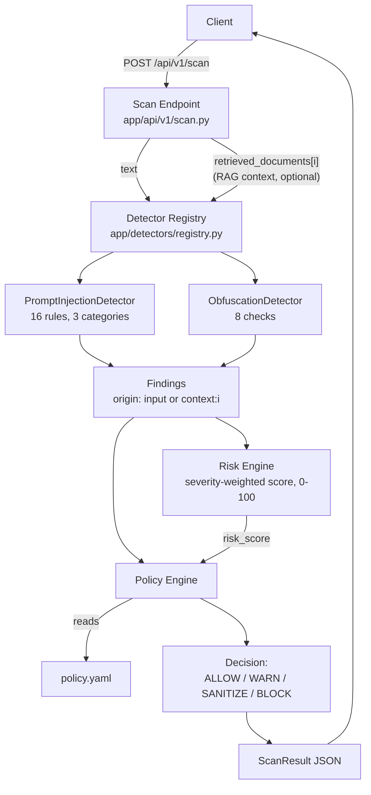

# Architecture

What's actually built and running today (v0.2) — not the long-term vision. For what's planned but not implemented, see the Current Status table in the main README.

## Request flow

## Components

| Component | File(s) | What it does |
|---|---|---|
| **Finding schema** | `app/models/finding.py` | The common data shape every detector, the risk engine, and the policy engine speak. A `Finding` is one detector's output; a `ScanResult` bundles all findings for one request plus the final score/decision. |
| **Detector interface** | `app/detectors/base.py`, `registry.py` | Every detector subclasses `BaseDetector` and self-registers with `@register_detector`. The gateway discovers detectors through the registry — it never imports a specific detector class by name. This is what makes adding a detector a no-core-changes operation (see `CONTRIBUTING.md`). |
| **Prompt injection detector** | `app/detectors/prompt_injection/` | Regex/heuristic phrase matching. Looks at what the text *means*. |
| **Obfuscation detector** | `app/detectors/obfuscation/` | Character/encoding-level checks. Looks at how the text is *encoded*, independent of meaning — a deliberately different mechanism than prompt_injection. See `docs/threat-model/README.md` for why both are needed together. |
| **Risk engine** | `app/services/risk_engine.py` | Combines findings into one 0-100 score. Deterministic, no ML. |
| **Policy engine** | `app/services/policy_engine.py`, `policy.yaml` | Maps findings + score to a final decision. Two layers (per-type rules, then score thresholds), most-severe-wins. Fully configurable without code changes. |
| **Scan endpoint** | `app/api/v1/scan.py` | Wires the above into one request: detect → score → decide. Also scans optional `retrieved_documents` (RAG context) through the same detectors, tagging each finding's `origin` so indirect injection (a retrieved document, not the user) is distinguishable from direct input. |

## Why detectors are separate from risk/policy

Detectors only ever answer "what did I find" — they never decide what should happen about it. That split is deliberate: the risk model and policy rules can change (new severity weights, new thresholds, a completely different decision policy per deployment) without touching a single detector, and a new detector can ship without knowing anything about scoring or policy. `app/services/` and `app/detectors/` don't import each other's internals — only the finding schema they share.

## Evaluation & regression tooling

| Component | File(s) | What it does |
|---|---|---|
| **Dataset normalization** | `scripts/build_eval_dataset.py` | Converts raw external datasets (`dataset/raw/`) into one unified schema (`dataset/processed/eval_set.jsonl`). |
| **Evaluation** | `scripts/evaluate.py` | Runs the full pipeline against the labeled dataset, computes precision/recall/F1/FPR, writes `eval_results.json`. |
| **Attack Replay Lab** | `scripts/replay_lab.py` | Snapshots per-example predictions under a version tag; compares any two snapshots to show newly-caught attacks, regressions, and new false positives. |

These live outside `app/` deliberately — they're development-time tooling the running service doesn't depend on.

## What's not in this diagram yet

RAG context inspection, agent/tool-call inspection, and output scanning are all designed in the original project doc but not implemented — see the Current Status table in the main README for exactly what's done vs planned.
